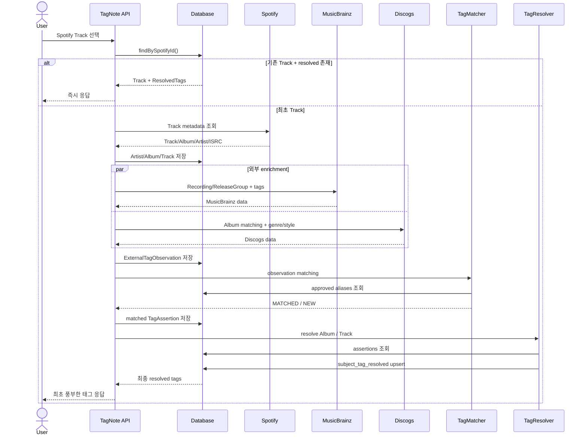
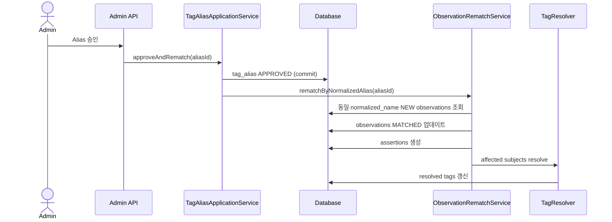
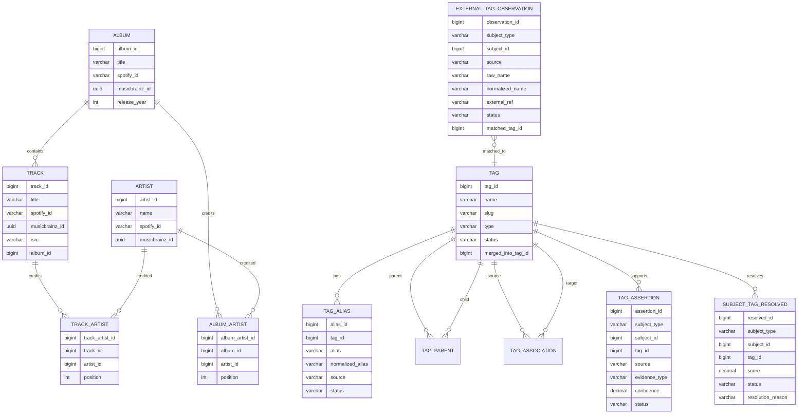

# TagNote Backend Domain & Data Design (v2 — 실무 적정 규모 조정판)
## DDD 기반 음악 태그 수집·정규화·해석·노출 백엔드 구현 명세

> 목적: Spotify를 단일 사용자 진입점으로 사용하면서 MusicBrainz/Discogs 등의 외부 음악 메타데이터를 수집하고, 내부 태그 taxonomy와 매칭한 뒤, 근거 기반 resolver를 통해 최종 태그를 제공하는 Spring Boot 백엔드의 구현 기준을 정의한다.
>
> **v2 변경 배경**: 이 프로젝트는 3년차 서버 개발자의 포트폴리오이며, 목표는 현업에서 실제로 쓰는 수준의 복잡도를 스터디 목적으로 재현하는 것이다. "이론적으로 가능한 확장"까지 전부 반영하기보다, Observation → Assertion → Resolution → Projection으로 이어지는 **태그 관리 파이프라인 자체**를 가장 잘 보여줄 수 있는 만큼만 구현한다. DB 스키마는 v1과 동일하게 유지하고, 실행/운영 레이어의 과도한 설계만 정리했다.

---

# 1. 핵심 설계 원칙

이 시스템의 핵심은 외부 태그를 그대로 화면에 노출하는 것이 아니다.

외부 소스의 데이터는 다음 3단계를 거친다.

```text
RAW                    EVIDENCE                SERVING
외부 원본 관찰          내부 taxonomy 해석       최종 사용자 노출
        │                       │                       │
        ▼                       ▼                       ▼
external_tag_          tag_assertion           subject_tag_
observation                                    resolved
```

각 테이블의 책임은 명확히 분리한다.

- `external_tag_observation`
    - 외부 소스가 실제로 반환한 원본 값을 보존한다.
    - 아직 내부 taxonomy와 매칭되지 않은 값도 버리지 않는다.
- `tag_assertion`
    - 외부 원본 또는 관리자의 판단이 어떤 내부 `tag`를 지지하는지 저장한다.
    - "왜 이 태그 후보가 생겼는가?"를 설명하는 evidence layer다.
- `subject_tag_resolved`
    - 여러 assertion과 상속 규칙을 종합한 최종 read model이다.
    - 사용자 화면은 이 테이블만 조회한다.

핵심 규칙:

```text
Observation = 외부가 무엇이라고 했는가
Assertion   = 그것을 우리 taxonomy에서 어떻게 해석했는가
Resolved    = 그래서 최종적으로 무엇을 보여줄 것인가
```

이 4단계 파이프라인(Identity → Observation → Assertion → Resolution)이 이 포트폴리오에서 가장 보여주고 싶은 부분이므로, 이후 실행 계층 설계는 이 파이프라인을 방해하지 않는 선에서 최대한 단순하게 유지한다.

---

# 2. 시스템의 사용자 관점 흐름

사용자에게 보이는 검색 시작점은 Spotify 하나로 통일한다.

```text
사용자
  │
  ▼
Spotify 검색
  │
  ▼
Spotify Track 선택
  │
  ▼
TagNote Backend
```

Spotify는 **Discovery / Entry Point** 역할이다.

Spotify ID가 MusicBrainz ID로 직접 변환되는 것은 아니다.

Spotify가 제공하는 메타데이터를 이용해 동일 음악을 MusicBrainz에서 다시 찾아 연결한다.

```text
Spotify Track
  ├─ spotify_id
  ├─ title
  ├─ artist
  ├─ album
  ├─ duration
  ├─ release date
  └─ ISRC
        │
        ▼
MusicBrainz Entity Matching
        │
        ▼
Recording MBID
        │
        ├─ Release
        └─ Release Group
```

즉 현실의 동일한 음악 엔티티에 대해 서로 다른 외부 시스템의 식별자를 연결하는 구조다.

```text
우리 Track
  ├─ Spotify Track ID
  ├─ ISRC
  └─ MusicBrainz Recording MBID
```

---

# 3. 외부 데이터 소스의 역할

## 3.1 Spotify

역할:

- 사용자 검색
- Track/Album/Artist 기본 메타데이터 획득
- ISRC 확보
- 내부 음악 엔티티 생성의 시작점

Spotify는 MVP에서 **태그 evidence source로 사용하지 않는다.**

```text
Spotify
= Discovery + Identity Seed
```

---

## 3.2 MusicBrainz

역할:

- Spotify Track을 MusicBrainz Recording으로 식별
- Recording MBID 확보
- Recording → Release → Release Group 연결
- Track/Album 수준의 외부 tag/genre 정보 수집

```text
Spotify Track
  │
  ├─ ISRC exact match
  │
  └─ fallback: title + artist + duration
  ▼
MusicBrainz Recording
  │
  ▼
Release Group
```

MVP 기준 권장 매핑:

```text
track.musicbrainz_id
= MusicBrainz Recording MBID

album.musicbrainz_id
= MusicBrainz Release Group MBID
```

`album.musicbrainz_id`가 Release인지 Release Group인지 모호해지지 않도록 코드와 문서에서 반드시 Release Group으로 고정한다.

가능하면 컬럼 이름도 다음처럼 구체화한다.

```text
track.musicbrainz_recording_id
album.musicbrainz_release_group_id
artist.musicbrainz_artist_id
```

---

## 3.3 Discogs

역할:

- Album 단위의 Genre / Style evidence 수집
- Track 직접 태그보다는 Album evidence source로 취급

기본 흐름:

```text
Discogs Release / Master
  │
  ├─ Genre
  └─ Style
       │
       ▼
ALBUM external_tag_observation
       │
       ▼
ALBUM tag_assertion
       │
       ▼
Album resolved tags
       │
       └─ confidence × 0.85
              ▼
        Track inherited tags
```

MVP에서는 Discogs의 Track 단위 태그 해석을 하지 않는다.

---

## 3.4 AllMusic

현재 MVP 범위에서는 제외한다.

MVP source:

```text
MUSICBRAINZ
DISCOGS
ADMIN
```

Spotify는 entity discovery source이지 `tag_assertion.source`가 아니다.

---

# 4. Bounded Context 제안

DDD 관점에서 다음 4개의 영역으로 분리하는 것을 권장한다.

```text
┌───────────────────────────────┐
│ 1. Music Catalog Context      │
│ Artist / Album / Track        │
└───────────────┬───────────────┘
                │
                ▼
┌───────────────────────────────┐
│ 2. Tag Taxonomy Context       │
│ Tag / Alias / Parent / Assoc  │
└───────────────┬───────────────┘
                │
                ▼
┌───────────────────────────────┐
│ 3. Tag Enrichment Context     │
│ Observation / Assertion       │
│ External Data Integration     │
└───────────────┬───────────────┘
                │
                ▼
┌───────────────────────────────┐
│ 4. Tag Resolution Context     │
│ Resolver / Resolved ReadModel │
└───────────────────────────────┘
```

MVP에서는 물리적으로 하나의 Spring Boot 애플리케이션과 하나의 DB를 사용해도 된다.

즉:

```text
DDD Context 분리
≠
Microservice 분리
```

처음부터 마이크로서비스로 나누지 않는다.

DDD의 Context 구분과 별개로 실제 애플리케이션 코드는 다음 Layer 구조를 사용한다.

```text
Presentation Layer
        ↓
Application Layer
        ↓
Domain Layer
        ↓
Infrastructure Layer
```

실제 호출은 use case에 따라 Application Service가 Infrastructure의 Repository/External Client를 함께 사용한다.

```text
Controller
   ↓
Service
   ├─ Domain Model / Domain Service
   ├─ Repository
   └─ External API Client
```

즉 이 문서에서 DDD는 **도메인 모델과 책임 경계**를 정의하고,
Layered Architecture는 **코드의 기술적 배치와 호출 구조**를 정의한다.

---

# 5. Music Catalog Context

## 5.1 Artist

```text
artist

- artist_id
- name
- spotify_id
- musicbrainz_id
```

책임:

- 아티스트의 내부 identity
- 외부 provider 식별자 연결

---

## 5.2 Album

```text
album

- album_id
- title
- spotify_id
- musicbrainz_id
- release_year
```

MVP 의미:

```text
album.musicbrainz_id
= MusicBrainz Release Group MBID
```

---

## 5.3 Track

```text
track

- track_id
- title
- spotify_id
- musicbrainz_id
- album_id
```

추가 권장 컬럼:

```text
- isrc
- duration_ms
```

MusicBrainz matching 품질을 높이는 데 매우 유용하다.

Album과 Track의 Artist 관계는 단일 `artist_id`가 아니라 `album_artist`, `track_artist` 연결 테이블을 유일한 source of truth로 사용한다. 각 연결 row의 `position`은 Spotify Artist 배열의 0-based 표시 순서를 보존하며 `position=0`을 대표 Artist로 해석한다.

```text
album_artist
- album_artist_id
- album_id
- artist_id
- position

track_artist
- track_artist_id
- track_id
- artist_id
- position
```

두 연결 테이블은 parent/Artist 및 parent/position 조합에 unique 제약을 둔다. JPA에서는 명시적 연결 Entity와 단방향 `ManyToOne(LAZY)`를 사용하며 Album, Track, Artist에 양방향 credit 컬렉션을 두지 않는다.

---

# 6. Music Catalog의 Aggregate 경계

Artist 전체에 Album과 Track을 묶은 거대한 Aggregate는 만들지 않는다.

권장:

```text
Artist = Aggregate Root
Album  = Aggregate Root
Track  = Aggregate Root
```

이유:

- Track 저장 때문에 Artist 전체를 로딩할 필요가 없다.
- Album의 수록곡 수가 커져도 Aggregate가 비대해지지 않는다.
- 외부 metadata enrichment가 Track/Album 단위로 독립 실행 가능하다.
- 실제 강한 일관성 요구가 Artist 전체에 걸쳐 존재하지 않는다.

Application Layer의 `TrackImportService`가 여러 Aggregate와 Repository를 orchestration한다.

```text
TrackImportService
  ├─ ArtistRepository
  ├─ AlbumRepository
  └─ TrackRepository
```

---

# 7. Tag Taxonomy Context

## 7.1 Tag

```text
tag

- tag_id
- name
- slug
- type
- status
- merged_into_tag_id
- description
- created_at
- updated_at
```

Enum:

```text
TagType
- GENRE
- STYLE
- SCENE
- COUNTRY
- ERA
```

```text
TagStatus
- ACTIVE
- CANDIDATE
- DEPRECATED
- MERGED
```

규칙:

- `MERGED`이면 `merged_into_tag_id` 필수
- `ACTIVE`가 최종 서비스 노출의 기본 대상
- MERGED chain은 cycle 금지

---

## 7.2 TagAlias

```text
tag_alias

- alias_id
- tag_id
- alias
- normalized_alias
- source
- status
```

Enum:

```text
AliasSource
- ADMIN
- MUSICBRAINZ
- DISCOGS
- USER
```

```text
AliasStatus
- PENDING
- APPROVED
- REJECTED
```

제약:

```sql
unique(tag_id, normalized_alias)
index(normalized_alias)
```

MVP matching에서는 `APPROVED` alias만 사용한다.

---

## 7.3 Tag Parent

```text
tag_parent

- parent_tag_id
- child_tag_id
```

용도:

```text
Electronic
  ↓
Experimental Electronic
  ↓
Electroacoustic
```

규칙:

- taxonomy 전용
- DAG
- cycle 금지
- 자기 자신 parent 금지

cycle 검사는 `TagHierarchyDomainService`에서 수행한다.

검사 시점은 사용자 조회 시점이 아니라 **관리자가 `tag_parent` edge를 추가하는 시점**이다. taxonomy는 관리자가 가끔 편집하는 소규모 데이터이므로, edge 하나를 추가할 때마다 즉시 그래프를 순회해 cycle 여부를 확인해도 비용이 사실상 없다. 진입점은 46번 섹션의 `POST /admin/tags/{tagId}/parent`이며, 검증을 통과해야 같은 트랜잭션 안에서 `tag_parent`가 insert된다.

---

## 7.4 Tag Association

```text
tag_association

- source_tag_id
- target_tag_id
- association_type
- weight
- source
```

Enum:

```text
RELATED_TO
DERIVED_FROM
INFLUENCED_BY
```

taxonomy와 recommendation graph를 섞지 않는다.

---

## 7.5 Tag Fusion

2차 확장이며 MVP 테이블 목록(63번 섹션)에도 포함하지 않는다.

```text
tag_fusion

- fusion_tag_id
- component_tag_id
- component_order
```

예:

```text
Jazz Rap
  ├─ Jazz
  └─ Hip Hop
```

MVP UI와 resolver에서는 완전히 제외한다.

---

# 8. Tag Aggregate 제안

`Tag`를 Aggregate Root로 본다.

Tag 내부에서 강하게 관리할 대상:

```text
Tag
  ├─ TagAlias
  └─ merge state
```

하지만 `tag_parent`, `tag_association`은 여러 Tag Aggregate 사이의 관계이므로 별도의 Domain Service/Repository에서 관리하는 편이 낫다.

```text
Tag
= Aggregate Root

TagHierarchy
= Domain Service

TagAssociation
= Relation Entity / Service
```

---

# 9. Tag Enrichment Context

이 Context는 외부에서 가져온 값을 내부 taxonomy에 연결하는 책임을 가진다.

핵심 엔티티:

```text
ExternalTagObservation
TagAssertion
```

---

# 10. ExternalTagObservation

```text
external_tag_observation

- observation_id
- subject_type
- subject_id
- source
- raw_name
- normalized_name
- external_ref
- status
- matched_tag_id
- observed_at
```

Enum:

```text
SubjectType
- TRACK
- ALBUM
```

MVP에서는 LABEL, ARTIST를 제외한다.

```text
ExternalTagSource
- MUSICBRAINZ
- DISCOGS
```

```text
ObservationStatus
- NEW
- MATCHED
- IGNORED
- PROMOTED
```

제약:

```sql
index(subject_type, subject_id)

unique(
  subject_type,
  subject_id,
  source,
  normalized_name,
  external_ref
)
```

---

# 11. Observation의 정확한 의미

`NEW`는 음악 전체의 처리 대기 상태가 아니다.

```text
NEW
≠ 이 Track의 태그 계산이 아직 안 됨

NEW
= 이 raw tag 하나를 내부 taxonomy로 아직 해석하지 못함
```

예:

```text
Discogs 반환

Electronic         MATCHED
Ambient            MATCHED
Drone              MATCHED
Hypnagogic Pop     MATCHED
Unknown Weird Tag  NEW
```

이 경우 최초 조회에서 resolver는 앞의 4개를 즉시 사용한다.

`Unknown Weird Tag`는 미래 재매칭용 원본 데이터로 보관한다.

---

# 12. Observation을 반드시 저장하는 이유

외부 raw tag를 즉시 assertion으로만 변환하면 매칭 실패 데이터가 사라진다.

예:

```text
Discogs raw:
"Deconstructed Club"

현재 내부 tag:
없음
```

Observation이 없다면:

```text
match 실패
→ 데이터 유실
```

나중에 `Deconstructed Club` tag를 추가해도 과거 모든 Album을 외부 API에서 다시 수집해야 한다.

Observation이 있으면:

```text
기존 NEW observation
→ 새 alias/tag 등록
→ 재매칭
→ assertion 생성
→ resolver 재실행
```

외부 API 재호출 없이 데이터가 확장된다.

추가 장점:

- 미매칭 raw tag 빈도 분석
- 새로운 tag 후보 발굴
- provider별 품질 분석
- 잘못된 매칭 디버깅
- resolver 정책 변경 시 재계산
- 외부 데이터 lineage 보존

---

# 13. TagAssertion

```text
tag_assertion

- assertion_id
- subject_type
- subject_id
- tag_id
- source
- evidence_type
- confidence
- status
- inherited_from_assertion_id
- created_at
```

Enum:

```text
AssertionSource
- MUSICBRAINZ
- DISCOGS
- ADMIN
```

```text
EvidenceType
- EXPLICIT_GENRE
- EXPLICIT_STYLE
```

2차 확장:

```text
REVIEW_TEXT
LABEL_PROFILE
ARTIST_PROFILE
```

```text
AssertionStatus
- PENDING
- APPROVED
- REJECTED
```

제약:

```sql
unique(
  subject_type,
  subject_id,
  tag_id,
  source,
  evidence_type
)

index(subject_type, subject_id)
index(tag_id)
```

---

# 14. Assertion의 정확한 의미

Assertion은 관계 테이블이 아니라 **근거 기록**이다.

예:

```text
Album 100
tag = Ambient
source = DISCOGS
evidence_type = EXPLICIT_STYLE
confidence = 0.80
```

뜻:

```text
Discogs의 Style 데이터가
Album 100을 Ambient라고 해석할 수 있는 근거를 제공했다.
```

---

# 15. Polymorphic Subject 처리

현재:

```text
subject_type + subject_id
```

는 DB FK를 직접 걸 수 없다.

따라서 애플리케이션에서 반드시 검증한다.

DDD에서는 `SubjectRef` Value Object로 감싼다.

```java
public record SubjectRef(
    SubjectType type,
    Long id
) {
}
```

검증:

```text
TRACK → TrackRepository.existsById(id)
ALBUM → AlbumRepository.existsById(id)
```

단순 Long 두 개를 코드 전체에 흩뿌리지 않는다.

---

# 16. Tag Matching Domain Service

외부 observation을 내부 taxonomy에 연결하는 책임.

권장 인터페이스:

```java
public interface TagMatcher {

    TagMatchResult match(
        ExternalTagObservation observation
    );
}
```

초기 알고리즘:

```text
raw_name
  ↓
normalize
  ↓
tag_alias.normalized_alias exact match
  ↓
APPROVED alias만 사용
  ↓
Tag canonicalization
  ↓
MATCHED or NEW
```

MVP에서는 fuzzy matching을 자동 확정에 사용하지 않는다.

잘못된 자동 매칭이 태그 품질을 훼손할 가능성이 크기 때문이다.

---

# 17. Normalization 정책

예:

```text
"  Intelligent Dance-Music "
→ "intelligent dance music"
```

초기 normalize 범위:

- trim
- lowercase
- Unicode normalization
- 연속 공백 축약
- 관리 가능한 punctuation normalization

주의:

```text
R&B
Drum 'n' Bass
2-Step
UK Garage
```

처럼 punctuation 자체가 의미를 가질 수 있으므로 과도한 제거는 금지한다.

Normalization은 별도 Value Object 또는 Domain Service로 둔다.

```java
NormalizedTagName
TagNameNormalizer
```

---

# 18. Tag Resolution Context

최종 사용자 노출 태그를 만드는 영역이다.

```text
subject_tag_resolved

- resolved_id
- subject_type
- subject_id
- tag_id
- score
- status
- resolution_reason
- last_resolved_at
```

Enum:

```text
ResolvedStatus
- ACTIVE
- HIDDEN
- MANUAL_FIXED
```

```text
ResolutionReason
- AUTO
- ADMIN_APPROVED
- INHERITED_FROM_ALBUM
```

제약:

```sql
unique(subject_type, subject_id, tag_id)
index(subject_type, subject_id, score)
```

---

# 19. Resolved는 Aggregate가 아니라 Projection

`subject_tag_resolved`는 source of truth가 아니다.

source of truth:

```text
Observation
Assertion
Tag Taxonomy
Resolver Policy
```

Resolved는 언제든 다시 계산할 수 있는 read model이다.

```text
Assertions
   │
   ▼
Resolver
   │
   ▼
subject_tag_resolved
```

따라서 Repository 역할도 query 중심으로 둔다.

```java
ResolvedTagRepository
```

---

# 20. Resolver MVP 정책

초기에는 지나치게 복잡한 수학식을 사용하지 않는다.

여기서 정의하는 `max(confidence)`, minimum score, Album 상속 가중치는 **이미 생성된 Assertion을 결합하는 Resolver 정책**이다. MusicBrainz/Discogs 응답으로부터 Assertion의 최초 confidence를 산정하는 Provider mapping 정책은 별도로 확정해야 한다.

우선순위:

```text
TRACK EXPLICIT
>
ADMIN
>
ALBUM INHERITED
```

권장 구체 정책:

### 직접 Track evidence

```text
Track explicit assertion
→ confidence 그대로 사용
```

### Album → Track 상속

```text
Track inherited score
= Album resolved score × 0.85
```

예:

```text
Album Drone = 0.80

Track Drone
= 0.80 × 0.85
= 0.68
```

### 동일 tag에 여러 assertion이 있을 때

MVP 권장:

```text
score = max(confidence)
```

처음부터 단순 합산하지 않는다.

이유:

- 같은 정보가 여러 provider에 중복되어 score가 비정상적으로 커지는 것을 방지
- source 개수가 많은 유명 앨범만 유리해지는 현상 방지
- resolver 설명 가능성 유지

2차 버전에서 source agreement bonus를 추가할 수 있다.

---

# 21. 직접 태그와 상속 태그 충돌

예:

```text
Track explicit Ambient = 0.95
Album inherited Ambient = 0.68
```

결과:

```text
Track explicit Ambient = 0.95
```

동일 tag에 대해 직접 evidence가 존재하면 Album inherited 결과는 최종 score를 덮어쓰지 않는다.

---

# 22. Tag MERGED 처리

resolver 직전에 모든 `tag_id`는 canonical tag로 변환한다.

예:

```text
IDM (MERGED)
→ Intelligent Dance Music (ACTIVE)
```

Resolved에는 MERGED tag가 직접 노출되지 않는다.

```text
assertion.tag_id
   ↓
canonicalTagResolver
   ↓
ACTIVE canonical tag
```

---

# 23. MANUAL_FIXED / HIDDEN 정책

resolver 전체 재계산 시 관리자가 수동 결정한 상태를 무조건 덮어쓰면 안 된다.

권장:

```text
MANUAL_FIXED
→ 자동 resolver가 score/status를 덮어쓰지 않음

HIDDEN
→ 명시적 해제 전까지 자동으로 ACTIVE 복귀시키지 않음
```

자동 계산 영역과 운영자 제어 영역을 분리한다.

---

# 24. 최초 조회 전략

TagNote는 태그가 핵심 가치이므로 최초 조회에서도 가능한 풍부한 태그를 보여준다.

권장 흐름:

```text
사용자가 Spotify Track 선택
        │
        ▼
내부 Track 존재?
     /       \
   YES       NO
    │         │
    ▼         ▼
Resolved    Spotify metadata 저장
즉시 반환        │
                 ▼
       외부 provider 병렬 수집
          /               \
 MusicBrainz             Discogs
          \               /
           ▼             ▼
       Observation 저장
              │
              ▼
         Alias Matching
              │
        ┌─────┴─────┐
        ▼           ▼
     MATCHED       NEW
        │           │
        ▼           └─ 원본만 보관
    Assertion
        │
        ▼
     Resolver
        │
        ▼
   Resolved Tag
        │
        ▼
    최초 응답
```

---

# 25. 최초 조회에서 NEW가 있어도 응답을 지연시키지 않는다

예:

```text
외부에서 10개 raw tag 수집

7 MATCHED
3 NEW
```

처리:

```text
7 MATCHED
→ assertion 생성
→ resolver
→ 사용자에게 즉시 제공

3 NEW
→ DB에 저장
→ 이후 alias/tag 추가 시 재매칭
```

즉 resolver는 **현재 해석 가능한 evidence의 최선 결과**를 즉시 만든다.

---

# 26. 외부 Provider 병렬 호출

초기 조회의 병목은 resolver가 아니다.

주요 지연:

```text
MusicBrainz HTTP
Discogs HTTP
```

따라서 Spotify metadata를 확보한 후 가능한 provider는 병렬 호출한다.

```text
                    ┌─ MusicBrainz
Spotify Metadata ───┤
                    └─ Discogs
```

구현은 `CompletableFuture.allOf`로 확정한다.

```java
CompletableFuture<List<ExternalTagData>> mbFuture =
    CompletableFuture.supplyAsync(() -> musicBrainzClient.getRecordingTags(mbid), executor);

CompletableFuture<List<ExternalTagData>> discogsFuture =
    CompletableFuture.supplyAsync(() -> discogsClient.getAlbumTags(albumInfo), executor);

CompletableFuture.allOf(mbFuture, discogsFuture).join();
```

Virtual Thread, WebClient reactive 체인, 별도 TaskExecutor 튜닝 같은 대안은 이 프로젝트 규모에서 다룰 이유가 없다. `CompletableFuture` + 고정 크기 `ExecutorService` 하나로 충분하며, 이유를 설명할 수 있는 가장 단순한 선택이 곧 현업에서도 통용되는 기본값이다.

---

# 27. Timeout / Partial Success 정책

외부 API 하나 때문에 전체 조회를 실패시키지 않는다.

예:

```text
MusicBrainz = SUCCESS
Discogs     = TIMEOUT
```

처리:

```text
MusicBrainz observation 저장
→ assertion
→ resolver
→ 사용자 응답
```

Discogs는 실패 상태로 기록하고 이후 재시도한다.

권장 개념:

```text
ExternalEnrichmentResult
- SUCCESS
- TIMEOUT
- NOT_FOUND
- FAILED
```

---

# 28. 음악 전체의 enrichment 상태는 별도로 관리

`external_tag_observation.status`를 음악 전체 처리 상태로 사용하지 않는다.

권장 테이블:

```text
subject_enrichment_status

- subject_type
- subject_id
- musicbrainz_status
- discogs_status
- resolution_status
- last_enriched_at
- last_resolved_at
- retry_exhausted(retry count)
```

Enum 예:

```text
NOT_STARTED
PROCESSING
SUCCESS
PARTIAL
FAILED
```

이 테이블은 선택사항이지만 운영과 재시도 로직이 생기면 매우 유용하다.

---

# 29. 최초 조회 응답 시간 목표

MVP 권장 목표:

```text
이미 수집된 Track
→ DB 조회 중심
→ 100~300ms 수준 목표

처음 보는 Track
→ MusicBrainz + Discogs 병렬
→ 약 1~2초 수준 목표
```

중요:

```text
완벽한 모든 데이터가 올 때까지 무한정 대기
```

하지 않는다.

정책은:

```text
정해진 시간 안에 얻은 최대한 풍부한 evidence로 resolver 실행
```

이다.

---

# 30. Infrastructure External Client

레이어드 아키텍처에서는 외부 API 연동을 별도의 Port/Adapter 구조로 추상화하지 않고,
**Infrastructure Layer의 외부 연동 Client/Service**로 배치한다.

Application Layer의 Service는 필요한 외부 Client를 주입받아 orchestration한다.

구조:

```text
Presentation Layer
        │
        ▼
Application Layer
TrackImportService
        │
        ├───────────────┐
        ▼               ▼
Domain Layer       Infrastructure Layer
TagMatcher         SpotifyClient
TagResolver        MusicBrainzClient
                   DiscogsClient
```

외부 API 구현 예:

```text
infrastructure.external.spotify.SpotifyClient
infrastructure.external.musicbrainz.MusicBrainzClient
infrastructure.external.discogs.DiscogsClient
```

예:

```java
@Component
public class MusicBrainzClient {

    public MusicBrainzRecordingResponse findRecording(
        SpotifyTrackMetadata spotifyTrack
    ) {
        // MusicBrainz HTTP API 호출
    }

    public List<ExternalTagData> getRecordingTags(
        String recordingMbid
    ) {
        // MusicBrainz HTTP API 호출
    }
}
```

```java
@Component
public class DiscogsClient {

    public DiscogsAlbumResponse findAlbum(
        String artistName,
        String albumTitle,
        Integer releaseYear
    ) {
        // Discogs API 호출
    }
}
```

원칙:

- Controller가 외부 API Client를 직접 호출하지 않는다.
- Domain Entity가 HTTP Client를 알지 않는다.
- 외부 API 호출과 응답 DTO 변환은 Infrastructure Layer가 담당한다.
- Application Service가 여러 외부 Client와 Domain Service를 조합한다.

---

# 31. Entity Matching Service

Spotify → MusicBrainz 연결은 **Application Layer의 Entity Matching Service**가 담당한다.

이 Service는 Infrastructure Layer의 `MusicBrainzClient`를 사용해 후보를 조회하고,
내부 matching 규칙을 적용한다.

예:

```java
@Service
public class MusicEntityMatchingService {

    private final MusicBrainzClient musicBrainzClient;

    public MusicBrainzMatchResult matchTrack(
        SpotifyTrackMetadata spotifyTrack
    ) {
        // 1. MusicBrainz 후보 조회
        // 2. ISRC / title / artist / duration 비교
        // 3. 최종 후보 결정
    }
}
```

역할 분리:

```text
MusicBrainzClient
= MusicBrainz API 호출과 응답 변환

MusicEntityMatchingService
= 여러 후보 중 동일 음악을 판단하는 matching 로직
```

matching 우선순위:

```text
1. ISRC exact match

2. ISRC 후보 여러 개
   → title + artist + duration 비교

3. ISRC 없음
   → title + artist 검색
   → duration + album + release year 비교
```

HTTP 요청 세부 구현은 `MusicBrainzClient`에 두고,
후보 판단 규칙은 `MusicEntityMatchingService`에 둔다.

---

# 32. Discogs Album Matching

Discogs도 별도 matching 책임을 둔다.

입력:

```text
album title
artist name
release year
```

가능하면 MusicBrainz matching 결과도 보조 정보로 활용하되, Discogs 호출 자체가 반드시 MusicBrainz 성공에 종속될 필요는 없다.

즉 병렬성을 유지한다.

```text
Spotify metadata
  ├─ MusicBrainz matching
  └─ Discogs album matching
```

---

# 33. 외부 Entity Mapping 개선안

외부 provider가 늘어날 경우 entity 테이블에 provider별 컬럼을 계속 추가하면 확장성이 떨어진다.

현재:

```text
spotify_id
musicbrainz_id
```

만으로 MVP를 시작할 수 있다.

하지만 Discogs까지 안정적으로 식별하려면 다음 generic mapping을 권장한다.

```text
external_entity_mapping

- mapping_id
- subject_type
- subject_id
- source
- external_entity_type
- external_id
- external_url
- confidence
- created_at
```

예:

```text
ALBUM 20 / SPOTIFY / ALBUM / xxx
ALBUM 20 / MUSICBRAINZ / RELEASE_GROUP / yyy
ALBUM 20 / DISCOGS / MASTER / zzz
```

장점:

- provider 추가 시 schema 변경 감소
- Discogs Release/Master 구분 가능
- entity matching confidence 기록 가능

MVP에서 반드시 필요한 것은 아니지만 장기적으로 권장한다.

---

# 34. Application Layer Service 구조

## 34.1 TrackSearchService

책임:

- 사용자 검색 요청
- Spotify 검색 API 호출
- 검색 후보 반환

```text
GET /api/search/tracks?q=...
```

이 단계에서는 내부 엔티티를 만들지 않아도 된다.

---

## 34.2 TrackImportService

사용자가 Spotify Track 하나를 선택한 뒤 호출.

권장 API:

```text
POST /api/tracks/import
```

Request:

```json
{
  "spotifyTrackId": "..."
}
```

중요:

검색 `GET` 요청 안에서 암묵적으로 DB mutation + 외부 enrichment를 실행하지 않는 것이 좋다.

명시적 command endpoint를 둔다.

---

# 35. TrackImportService 상세 흐름

```text
1. spotifyTrackId로 내부 Track 조회

2. 이미 존재하고 resolved tag 있음
   → 즉시 반환

3. Spotify metadata 조회

4. Artist find-or-create

5. Album find-or-create

6. Track find-or-create

7. MusicBrainz / Discogs 병렬 수집

8. 외부 응답을 observation으로 저장

9. observation 즉시 matching

10. MATCHED observation → assertion 생성

11. Album resolver 실행

12. Album → Track inheritance 생성/계산

13. Track resolver 실행

14. Track detail response 반환
```

---

# 36. Transaction 경계

외부 HTTP API 호출을 DB transaction 안에서 실행하지 않는다.

나쁜 예:

```text
@Transactional
  ↓
Spotify HTTP
  ↓
MusicBrainz HTTP
  ↓
Discogs HTTP
  ↓
DB save
```

외부 API가 느려질 때 DB connection/lock을 오래 점유하게 된다.

권장:

```text
[외부 호출 단계]
Spotify / MusicBrainz / Discogs
        ↓

[DB Transaction]
catalog 저장
observation 저장
assertion 저장
resolved 갱신
        ↓

commit
```

필요하면 저장 단계를 더 작은 transaction으로 분리한다.

---

# 37. Idempotency

같은 Spotify Track이 동시에 여러 사용자에게 처음 선택될 수 있다.

따라서 import는 반드시 idempotent해야 한다.

DB unique:

```text
artist.spotify_id UNIQUE
album.spotify_id UNIQUE
track.spotify_id UNIQUE
```

observation:

```text
UNIQUE(
  subject_type,
  subject_id,
  source,
  normalized_name,
  external_ref
)
```

assertion:

```text
UNIQUE(
  subject_type,
  subject_id,
  tag_id,
  source,
  evidence_type
)
```

resolved:

```text
UNIQUE(
  subject_type,
  subject_id,
  tag_id
)
```

중복 요청이 들어와도 최종 데이터는 한 건만 존재해야 한다.

---

# 38. Concurrent First Import

동시에 두 요청이 같은 Track을 import하면:

```text
Request A ─┐
           ├─ same Spotify Track
Request B ─┘
```

application에서 단순 `find → 없으면 insert`만 하면 race condition이 생길 수 있다.

해결:

- DB unique constraint를 최종 방어선으로 사용
- duplicate key 발생 시 기존 row 재조회

이 두 가지만으로 충분하다. 단일 인스턴스로 운영되는 포트폴리오 규모에서 분산 락(Redis lock, ZooKeeper 등)까지 도입하는 것은 실제 트래픽이 근거가 될 때의 이야기이며, 지금 단계에서 언급할 필요조차 없다. unique constraint 위반을 `DataIntegrityViolationException`으로 잡아서 기존 row를 재조회하는 흐름 하나만 구현한다.

---

# 39. Resolver의 Idempotency

resolver는 같은 입력에 대해 동일 결과를 만들어야 한다.

```text
resolve(subject)
```

를 여러 번 호출해도:

```text
resolved row 중복 없음
score drift 없음
```

이 보장되어야 한다.

권장 방식:

```text
1. 현재 assertion 전체 조회
2. 계산 결과 Map<TagId, ResolvedCandidate> 생성
3. 기존 AUTO resolved와 diff
4. upsert
5. 더 이상 존재하지 않는 AUTO result 제거/비활성화
6. MANUAL_FIXED / HIDDEN 보존
```

---

# 40. Alias 승인 후 재매칭

관리자가 alias를 승인하면 기존 NEW observation을 다시 조회한다.

```text
alias 승인
  ↓
normalized_alias 기준 NEW observation 조회
  ↓
matched_tag_id 업데이트
  ↓
status = MATCHED
  ↓
assertion 생성
  ↓
affected subject resolver 재실행
```

이 흐름은 `TagAliasApplicationService`가 alias 승인 트랜잭션을 커밋한 직후, 같은 서비스 계층에서 `ObservationRematchService`를 **동기적으로 직접 호출**하는 것으로 구현한다.

```java
@Service
public class TagAliasApplicationService {

    private final TagAliasRepository aliasRepository;
    private final ObservationRematchService rematchService;

    @Transactional
    public void approve(Long aliasId) {
        TagAlias alias = aliasRepository.getById(aliasId);
        alias.approve();
        aliasRepository.save(alias);
    }

    public void approveAndRematch(Long aliasId) {
        approve(aliasId);
        rematchService.rematchByNormalizedAlias(aliasId);
    }
}
```

alias 승인은 관리자가 드물게 수행하는 액션이고, 재매칭 대상 observation 수도 크지 않다. 이 정도 처리량에 Spring `ApplicationEvent` + `@TransactionalEventListener(AFTER_COMMIT)` 같은 이벤트 기반 비동기 분리를 도입하는 것은 오히려 흐름을 추적하기 어렵게 만든다. 트래픽이 커져 alias 승인 1건당 재매칭 대상 observation이 수만 건 단위로 늘어나는 시점이 오면 그때 이벤트/큐 기반으로 전환한다.

---

# 41. Scheduled Rematch

이벤트 기반 누락을 보완하기 위해 배치도 둔다.

예:

```text
매일 새벽

NEW external_tag_observation
→ approved alias match
→ MATCHED
→ assertion 생성
→ resolver
```

MVP는 Spring Scheduler로 시작한다. Spring Batch는 대상 데이터가 커지고 재시작/청크 처리 요구가 생길 때 도입한다.

---

# 42. 상속 처리 방식

Album tag를 Track으로 전파하는 방법은 두 가지가 있다.

### 방식 A: inherited assertion을 실제 저장

```text
tag_assertion
- inherited_from_assertion_id
```

장점:

- lineage 명확
- 디버깅 쉬움

단점:

- Track 수가 많으면 assertion row 증가

### 방식 B: resolver 계산 시 Album resolved를 직접 참조

장점:

- DB row 감소

단점:

- lineage가 덜 명확
- resolver가 더 복잡

현재 schema에 `inherited_from_assertion_id`가 이미 있으므로 MVP는 A를 사용하는 것이 자연스럽다.

---

# 43. Inherited Assertion 생성 규칙

예:

```text
Album assertion
tag = Drone
confidence = 0.80
```

Track:

```text
Track inherited assertion
tag = Drone
confidence = 0.68
inherited_from_assertion_id = Album assertion id
```

계산:

```text
0.80 × 0.85 = 0.68
```

단 Track에 동일 tag explicit assertion이 있으면 최종 resolver는 explicit을 우선한다.

---

# 44. Album 전체 수록곡으로 상속 확장

Album enrichment가 완료되면 해당 Album의 모든 Track으로 inherited assertion을 만들 수 있다.

장점:

- 이후 동일 Album 수록곡 최초 조회 속도 향상
- 외부 API 추가 호출 감소

단, Album에 Track이 아직 일부만 저장되어 있다면 현재 존재하는 Track에만 적용한다.

나중에 Track이 새로 import되면 Album resolved/assertion을 이용해 즉시 inheritance를 생성한다.

---

# 45. API Read Model

사용자 상세 페이지는 assertion을 직접 조회하지 않는다.

예:

```text
GET /api/tracks/{trackId}
```

Response 예:

```json
{
  "trackId": 100,
  "title": "Example",
  "artist": {
    "artistId": 10,
    "name": "Artist"
  },
  "album": {
    "albumId": 20,
    "title": "Album",
    "releaseYear": 2025
  },
  "tags": [
    {
      "tagId": 1,
      "name": "Ambient",
      "score": 0.94
    },
    {
      "tagId": 2,
      "name": "Drone",
      "score": 0.87
    }
  ],
  "enrichmentStatus": "SUCCESS"
}
```

태그는 `subject_tag_resolved`에서 조회한다.

---

# 46. Admin API

운영자 기능의 최소 범위:

```text
POST /admin/tags
POST /admin/tags/{tagId}/aliases
PATCH /admin/tag-aliases/{aliasId}/approve
PATCH /admin/tag-aliases/{aliasId}/reject
POST /admin/tags/{tagId}/parent
DELETE /admin/tags/{tagId}/parent/{parentTagId}
POST /admin/tags/{tagId}/merge
GET /admin/external-tags/unmatched
```

`POST /admin/tags/{tagId}/parent`는 `{ "parentTagId": ... }`를 받아 `TagHierarchyDomainService`로 cycle 여부를 검증한 뒤, 통과할 때만 같은 트랜잭션에서 `tag_parent` row를 생성한다. cycle이 감지되면 edge를 만들지 않고 예외를 반환한다.

특히:

```text
GET /admin/external-tags/unmatched
```

는 다음 집계를 제공하면 유용하다.

```text
normalized_name
count
sources
sample_subjects
first_observed_at
last_observed_at
```

새 taxonomy 후보를 데이터 기반으로 결정할 수 있다.

---

# 47. 미매칭 태그 분석 쿼리

예:

```sql
SELECT
    normalized_name,
    COUNT(*) AS observation_count
FROM external_tag_observation
WHERE status = 'NEW'
GROUP BY normalized_name
ORDER BY observation_count DESC;
```

이 결과는 내부 태그 확장 우선순위에 직접 활용할 수 있다.

---

# 48. 레이어드 아키텍처 패키지 구조 예시

DDD의 Bounded Context와 Aggregate 개념은 유지하되,
코드의 상위 패키지는 **기술적 Layer 기준**으로 분리한다.

권장:

```text
com.tagnote
│
├─ presentation
│  ├─ track
│  │  ├─ TrackSearchController
│  │  └─ TrackController
│  ├─ tag
│  │  └─ TagAdminController
│  └─ dto
│
├─ application
│  ├─ catalog
│  │  ├─ TrackSearchService
│  │  └─ TrackImportService
│  ├─ enrichment
│  │  ├─ ExternalTagCollectionService
│  │  ├─ MusicEntityMatchingService
│  │  ├─ ObservationMatchingService
│  │  └─ ObservationRematchService
│  ├─ taxonomy
│  │  └─ TagManagementService
│  └─ resolution
│     └─ TagResolutionService
│
├─ domain
│  ├─ catalog
│  │  ├─ artist
│  │  ├─ album
│  │  └─ track
│  ├─ taxonomy
│  │  ├─ tag
│  │  ├─ alias
│  │  ├─ hierarchy
│  │  └─ association
│  ├─ enrichment
│  │  ├─ observation
│  │  ├─ assertion
│  │  └─ subject
│  └─ resolution
│     └─ resolver
│
├─ infrastructure
│  ├─ persistence
│  │  ├─ catalog
│  │  ├─ taxonomy
│  │  ├─ enrichment
│  │  └─ resolution
│  ├─ external
│  │  ├─ spotify
│  │  │  └─ SpotifyClient
│  │  ├─ musicbrainz
│  │  │  └─ MusicBrainzClient
│  │  └─ discogs
│  │     └─ DiscogsClient
│  └─ scheduler
│
└─ shared
   ├─ exception
   ├─ config
   └─ util
```

`infrastructure.persistence` 각 하위 패키지는 JPA Entity + Spring Data Repository만 둔다. Domain Entity와 JPA Entity를 분리하는 별도 Mapper 계층은 지금 만들지 않는다. Track/Album/Artist/Tag/Observation/Assertion 모두 도메인 로직이 아직 JPA 애노테이션과 공존해도 문제가 되지 않을 만큼 단순하기 때문이다. 도메인 로직이 영속성 관심사와 얽혀 실제로 테스트하기 어려워지는 시점이 오면, 그 엔티티 하나에 한해 분리를 검토한다.

핵심은:

```text
상위 패키지
= Layer 기준

각 Layer 내부
= Catalog / Taxonomy / Enrichment / Resolution 도메인 기준
```

즉 DDD의 도메인 경계를 버리는 것이 아니라,
**레이어드 아키텍처 안에서 도메인별 하위 패키지를 유지한다.**

---

# 49. 레이어 의존 구조

기본 요청 흐름은 다음과 같다.

```text
Controller
   │
   ▼
Application Service
   │
   ├───────────────┬──────────────────┐
   ▼               ▼                  ▼
Domain Model   Repository        External Client
Domain Service  (Persistence)     (Infrastructure)
```

실제 Track 최초 조회 예:

```text
TrackController
      │
      ▼
TrackImportService
      │
      ├─ ArtistRepository
      ├─ AlbumRepository
      ├─ TrackRepository
      │
      ├─ SpotifyClient
      ├─ MusicBrainzClient
      ├─ DiscogsClient
      │
      ├─ MusicEntityMatchingService
      ├─ TagMatchingService
      └─ TagResolutionService
```

각 Layer의 책임:

### Presentation Layer

```text
Controller
Request / Response DTO
HTTP validation
HTTP status mapping
```

비즈니스 규칙을 넣지 않는다.

### Application Layer

```text
use case orchestration
transaction 경계 제어
여러 Repository 호출
외부 Client 호출 순서 제어
Domain Service 실행
```

예:

```text
TrackSearchService
TrackImportService
ExternalTagCollectionService
ObservationRematchService
TagResolutionService
```

### Domain Layer

```text
Entity
Aggregate
Value Object
Domain Service
Domain Rule
```

예:

```text
Track
Album
Tag
ExternalTagObservation
TagAssertion
TagResolver
TagNameNormalizer
```

Domain Layer는 다음 기술 세부사항을 알지 않는다.

```text
HTTP
JSON
WebClient
RestClient
JPA query
Spotify API
Discogs API
```

### Infrastructure Layer

```text
DB 접근
JPA Repository
외부 HTTP API Client
Scheduler
Batch
외부 응답 DTO / mapper
```

즉 레이어드 아키텍처에서 핵심 호출 흐름은:

```text
Controller
→ Service
→ Repository / External Client
```

이고, Service가 필요한 Domain 객체와 Domain Service를 사용해 비즈니스 규칙을 수행한다.

---

# 50. Repository 구조 예시

Repository는 Infrastructure Layer에 배치한다.

Spring Data JPA를 사용할 경우 예:

```java
@Repository
public interface TrackJpaRepository
    extends JpaRepository<TrackEntity, Long> {

    Optional<TrackEntity> findBySpotifyId(String spotifyId);
}
```

```java
@Repository
public interface ObservationJpaRepository
    extends JpaRepository<ExternalTagObservationEntity, Long> {

    List<ExternalTagObservationEntity>
        findByStatusAndNormalizedName(
            ObservationStatus status,
            String normalizedName
        );
}
```

```java
@Repository
public interface AssertionJpaRepository
    extends JpaRepository<TagAssertionEntity, Long> {

    List<TagAssertionEntity>
        findBySubjectTypeAndSubjectIdAndStatus(
            SubjectType subjectType,
            Long subjectId,
            AssertionStatus status
        );
}
```

Application Service는 Repository를 주입받아 persistence를 수행한다.

```java
@Service
public class TrackImportService {

    private final TrackJpaRepository trackRepository;
    private final AlbumJpaRepository albumRepository;
    private final ArtistJpaRepository artistRepository;

    // ...
}
```

MVP에서는 Repository Port와 별도 Adapter 클래스를 추가하지 않는다. JPA Entity를 Domain Entity로 그대로 사용한다.

---

# 51. 주요 Domain Service 목록

```text
MusicEntityMatchingService
TagNameNormalizer
TagMatchingService
TagHierarchyService
CanonicalTagService
TagResolver
TagInheritanceService
```

Application Layer의 Service가 Repository/External Client 호출과 함께 이 Domain Service들을 orchestration한다.

---

# 52. ExternalTagObservation Aggregate

Observation 하나는 독립 Aggregate로 봐도 충분하다.

행위:

```text
match(tagId)
ignore()
promote(tagId)
```

예:

```java
observation.match(tagId);
```

직접 setter로 status와 matchedTagId를 제각각 변경하지 않는다.

Domain invariant:

```text
MATCHED이면 matched_tag_id 필수
NEW이면 matched_tag_id null 허용
IGNORED이면 자동 assertion 생성 금지
```

이런 행위 메서드로 invariant를 강제하는 건 리치 도메인 모델의 기본이고, 이 프로젝트에서 실제로 지켜야 할 규칙(예: MATCHED인데 matched_tag_id가 없는 상태)이 setter 방식으로는 쉽게 깨질 수 있는 부분이라 유지한다. 과설계가 아니라 이 시스템에서 정말 지켜야 하는 불변식이다.

---

# 53. TagAssertion Aggregate

행위:

```text
approve()
reject()
```

외부 provider에서 exact alias match된 assertion을 자동 APPROVED로 만들 것인지,
우선 PENDING으로 만들 것인지는 서비스 운영 정책에 따라 다르다.

MVP 권장:

```text
APPROVED alias exact match
+
신뢰 가능한 provider explicit genre/style
→ assertion 자동 APPROVED
```

관리자 검토가 필요한 fuzzy match는 MVP에서 생성하지 않는다.

---

# 54. Resolver 입력

Resolver는 외부 API를 호출하지 않는다.

입력은 오직 내부 데이터다.

```text
Approved Assertions
Tag canonical state
Parent/merge rules
Inheritance policy
Manual resolved state
```

즉 resolver는 pure domain calculation에 가깝게 유지한다.

---

# 55. Resolver 출력

```java
public record ResolvedTagCandidate(
    TagId tagId,
    double score,
    ResolutionReason reason
) {}
```

Application Service가 결과를 projection table에 반영한다.

---

# 56. Resolver pseudocode

```text
resolve(subject):

1. approved assertions 조회

2. assertion.tag를 canonical ACTIVE tag로 변환

3. 동일 tag 그룹화

4. direct explicit evidence 계산

5. inherited evidence 계산

6. direct가 존재하면 inherited 우선순위 낮춤

7. tag별 score 산출

8. minimum score 이하 제거

9. MANUAL_FIXED / HIDDEN 상태 병합

10. subject_tag_resolved upsert
```

MVP minimum score는 운영하면서 조정 가능하도록 설정값으로 둔다.

---

# 57. Configuration으로 분리할 정책

코드에 숫자를 하드코딩하지 않는다.

예:

```yaml
tag:
  resolution:
    album-to-track-inheritance-weight: 0.85
    minimum-score: 0.50
  enrichment:
    musicbrainz-timeout-ms: 1500
    discogs-timeout-ms: 1500
    total-first-load-budget-ms: 2000
```

---

# 58. 실패 처리

외부 provider 실패는 사용자 요청 전체 실패로 전파하지 않는다.

```text
Provider failure
→ enrichment status 기록
→ 다른 성공 provider로 resolve
→ partial response 반환
```

단 Spotify 자체에서 Track metadata를 찾을 수 없다면 import 자체가 실패할 수 있다.

---

# 59. 재시도 정책

재시도 대상:

```text
TIMEOUT
FAILED
```

재시도 제외:

```text
NOT_FOUND
```

단 NOT_FOUND도 일정 기간 후 source 데이터 변경 가능성을 고려해 수동 재시도할 수 있다.

MVP는 Scheduler 기반으로 충분하다.

---

# 60. Read 성능

사용자 조회는 거의 항상 projection table만 본다.

```text
track
album
artist
subject_tag_resolved
tag
```

복잡한 assertion 집계를 매 요청마다 계산하지 않는다.

이것이 `subject_tag_resolved`를 유지하는 가장 큰 이유다.

---

# 61. Cache 전략

MVP에서는 DB projection만으로 시작한다.

Redis는 반드시 필요하지 않다.

추후 traffic 증가 시:

```text
track detail
tag resolved list
```

정도만 cache candidate가 된다.

source of truth는 계속 DB다.

---

# 62. 현재 MVP 테이블

필수:

```text
artist
album
track

tag
tag_alias
tag_parent
tag_association

external_tag_observation
tag_assertion
subject_tag_resolved
```

권장 추가:

```text
subject_enrichment_status
```

선택적 개선:

```text
external_entity_mapping
```

제외:

```text
label
review text extraction
artist profile inheritance
label profile inheritance
fusion UI
graph recommendation
Kafka
LLM tag extraction
```

---

# 63. 전체 Sequence



---

# 64. Alias 승인 후 재매칭 Sequence



alias 승인과 재매칭을 같은 서비스 계층에서 순차 호출하는 동기 흐름으로 단순화했다. 이벤트 버스를 거치지 않기 때문에 승인 API 응답 안에서 재매칭 결과(몇 건이 MATCHED로 전환됐는지)까지 바로 돌려줄 수 있다는 부가 이점도 있다.

---

# 65. ERD 개념도



`subject_type + subject_id`는 polymorphic reference이므로 ERD상 실제 DB FK가 직접 연결되지 않는다는 점에 유의한다.

---

# 66. 개발 순서

## Phase 1 — Catalog

구현:

```text
Spotify search
Artist
Album
Track
Track import
```

완료 조건:

- Spotify Track 선택으로 내부 Artist/Album/Track 생성 가능
- 동일 Spotify ID 중복 생성 없음

---

## Phase 2 — Taxonomy

구현:

```text
Tag
TagAlias
Normalization
Tag CRUD
Alias approve/reject
```

완료 조건:

- raw string을 approved alias로 exact match 가능

---

## Phase 3 — External Enrichment

착수 전 Policy Gate:

```text
First Vertical Slice의 Fake External Tag
→ 테스트 fixture confidence로 종단 간 연결 검증
→ Human Review로 Evidence Confidence 정책 승인
→ MusicBrainz/Discogs Adapter 구현
```

External Enrichment 구현 전에 다음을 결정한다.

- MusicBrainz genre/tag 및 Discogs genre/style별 기본 confidence
- Entity Matching confidence와 Tag Evidence confidence의 분리 또는 결합 방식
- Provider vote/count를 사용할지 여부와 정규화 방식
- evidence 누락/저품질 응답의 제외 기준

Fake External Tag의 고정 confidence는 production 정책이 아니며, 이 결정을 대신하지 않는다. 정책이 승인되기 전에는 Provider Adapter에 임의의 숫자를 하드코딩하지 않는다.

구현:

```text
MusicBrainz matching
MusicBrainz tag provider
Discogs album provider
ExternalTagObservation
```

완료 조건:

- Track 최초 import 시 외부 raw tag가 observation으로 저장됨
- 미매칭 값도 NEW로 보존됨

---

## Phase 4 — Assertion

구현:

```text
TagMatcher
MATCHED observation → TagAssertion
```

완료 조건:

- matched observation마다 중복 없이 assertion 생성
- source/evidence/confidence 추적 가능

---

## Phase 5 — Resolver

구현:

```text
Album resolver
Album → Track inheritance
Track resolver
subject_tag_resolved
```

완료 조건:

- 화면 API가 assertion이 아니라 resolved를 조회
- 같은 resolver 재실행에도 결과 idempotent

---

## Phase 6 — Rematch

구현:

```text
alias 승인 → 동기 rematch 호출
NEW observation rematch
Scheduler fallback
```

완료 조건:

- 새 alias 추가 후 외부 API 재호출 없이 과거 NEW 데이터가 MATCHED로 전환
- 관련 subject resolved 자동 갱신

---

# 67. 테스트 전략

포트폴리오 개발 순서상, 아래 우선순위로 테스트를 채워나간다. 세 계층을 동시에 갖추는 것이 목표가 아니라, **이 시스템의 가치가 걸린 로직부터** 순서대로 검증하는 것이 목표다.

## 1순위 — Resolver / Domain 핵심 로직 (Unit Test)

이 프로젝트에서 실제로 버그가 나면 안 되는 부분이다.

```text
Resolver 우선순위 (TRACK EXPLICIT > ADMIN > ALBUM INHERITED)
Album → Track 상속 가중치 (0.85 계산)
동일 tag 다중 assertion의 max(confidence) 정책
MERGED tag canonical 변환
MANUAL_FIXED / HIDDEN 보존
Tag normalization (R&B, 2-Step 같은 punctuation 케이스)
Hierarchy cycle 검증
Observation / Assertion 상태 전이 invariant
```

예:

```text
given Track explicit Drone 0.90
and Album inherited Drone 0.68
when resolve
then score = 0.90
```

## 2순위 — Application 흐름 (Integration Test)

```text
TrackImportService 전체 흐름 (fake external client 사용)
Alias 승인 → 동기 rematch 흐름
Resolver 결과의 DB 반영(idempotent upsert)
Concurrent duplicate import (unique constraint 충돌 재조회)
```

## 3순위 — Infrastructure (필요할 때만)

```text
MusicBrainz / Discogs 응답 매핑
JPA unique constraint 위반 시나리오
```

1, 2순위만 충실히 갖춰도 이 시스템이 "왜 이렇게 설계했는지"를 테스트로 증명할 수 있다. 3순위는 실제 API 연동 코드를 붙이는 시점에 맞춰 추가한다.

---

# 68. 중요 Anti-Pattern

## 금지 1

```text
외부 raw tag
→ 바로 track_tag 저장
```

원본/근거/결과가 섞인다.

---

## 금지 2

```text
사용자 화면
→ tag_assertion 직접 조회
```

evidence와 serving model의 책임이 섞인다.

---

## 금지 3

```text
NEW observation 존재
→ Track 전체 processing pending
```

잘못된 해석이다.

NEW는 개별 raw tag 미매칭 상태일 뿐이다.

---

## 금지 4

```text
MusicBrainz 실패
→ 전체 Track import 실패
```

가능한 provider 성공 결과로 partial resolve한다.

---

## 금지 5

```text
외부 HTTP 호출을 긴 @Transactional 안에서 수행
```

DB resource를 불필요하게 오래 점유한다.

---

## 금지 6

```text
Tag hierarchy와 RELATED_TO를 한 테이블에서 동일 edge로 처리
```

taxonomy 탐색과 연관 그래프 탐색이 섞인다.

---

## 금지 7 (v2 추가)

```text
드문 admin 액션 하나를 위해 이벤트 버스/분산 락 같은
운영 트래픽 규모에서나 필요한 인프라를 미리 도입
```

지금 규모에서 증명해야 할 것은 "필요할 때 확장 가능하게 설계했는가"이지 "모든 확장을 이미 구현했는가"가 아니다. 동기 호출 + DB unique constraint로 충분한 곳에 비동기/분산 인프라를 먼저 깔면, 오히려 태그 파이프라인 자체의 설계 의도가 코드에 묻힌다.

---

# 69. 최종 아키텍처 요약

```text
                    USER
                     │
                     ▼
                 Spotify
                     │
              Track selected
                     │
                     ▼
             Music Catalog
          Artist / Album / Track
                     │
                     ▼
          External Enrichment
          /                 \
 MusicBrainz               Discogs
          \                 /
           ▼               ▼
       ExternalTagObservation
             RAW LAYER
                │
                ▼
             TagAlias
                │
             matching
                │
         ┌──────┴──────┐
         ▼             ▼
      MATCHED          NEW
         │             │
         ▼             └─ future rematch
     TagAssertion
      EVIDENCE
         │
         ▼
      TagResolver
         │
         ▼
 SubjectTagResolved
      READ MODEL
         │
         ▼
        UI/API
```

---

# 70. 가장 중요한 구현 판단

이 시스템의 핵심 객체는 단순 `track_tag`가 아니다.

핵심은 다음 pipeline이다.

```text
Identity
→ Observation
→ Matching
→ Assertion
→ Resolution
→ Projection
```

그리고 각 단계는 서로 다른 질문에 답한다.

```text
Identity
"이 음악이 정확히 무엇인가?"

Observation
"외부 소스가 이 음악을 뭐라고 불렀는가?"

Matching
"그 표현은 우리 taxonomy의 어떤 tag인가?"

Assertion
"그 tag를 지지하는 근거는 무엇인가?"

Resolution
"여러 근거 중 무엇을 최종 채택할 것인가?"

Projection
"사용자 화면에서는 무엇을 빠르게 읽을 것인가?"
```

이 책임 분리를 유지하는 것이 TagNote 백엔드의 가장 중요한 설계 원칙이며, 포트폴리오에서 강조해야 할 지점도 바로 이 6단계 파이프라인이다. 나머지 실행 계층(병렬 호출 방식, 이벤트 유무, 락 전략 등)은 이 파이프라인을 안정적으로 돌리기 위한 수단일 뿐, 그 자체가 보여주고 싶은 목표가 아니다.

---

# 71. MVP 최종 권장 스택 관점

논리적 권장:

```text
Spring Boot
JPA
Relational DB
CompletableFuture 기반 병렬 외부 호출
Spring Scheduler (필요해지면 Spring Batch로 전환)
```

초기에는 제외:

```text
Kafka
Microservice
Graph DB
LLM based tag inference
Complex fuzzy auto matching
Redis mandatory dependency
분산 락
이벤트 기반 비동기 처리
```

데이터가 커지고 resolver 이벤트 처리량이 증가한 뒤 단계적으로 도입한다.

---

# 72. 구현 완료 기준

MVP를 "완주"했다고 판단할 수 있는 최소 조건:

1. Spotify에서 Track 검색/선택 가능
2. Track/Album/Artist 내부 저장
3. Spotify metadata로 MusicBrainz Recording 식별
4. MusicBrainz/Discogs tag data 수집
5. 외부 raw tag가 Observation으로 모두 보존
6. approved alias 기준 exact match
7. matched observation에서 assertion 생성
8. Album/Track resolver 동작
9. Album → Track 0.85 상속 동작
10. 상세 페이지는 `subject_tag_resolved`만 조회
11. NEW observation은 최초 응답을 막지 않음
12. alias 추가 후 NEW observation 재매칭 가능 (동기 호출)
13. 외부 provider 하나 실패해도 partial result 제공
14. 동일 Track 재조회 시 외부 API 없이 resolved 결과 즉시 반환
15. 모든 import/resolution 흐름이 idempotent

이 15개가 동작하면 현재 정의한 TagNote의 핵심 태그 데이터 파이프라인은 완성된 것으로 본다.
